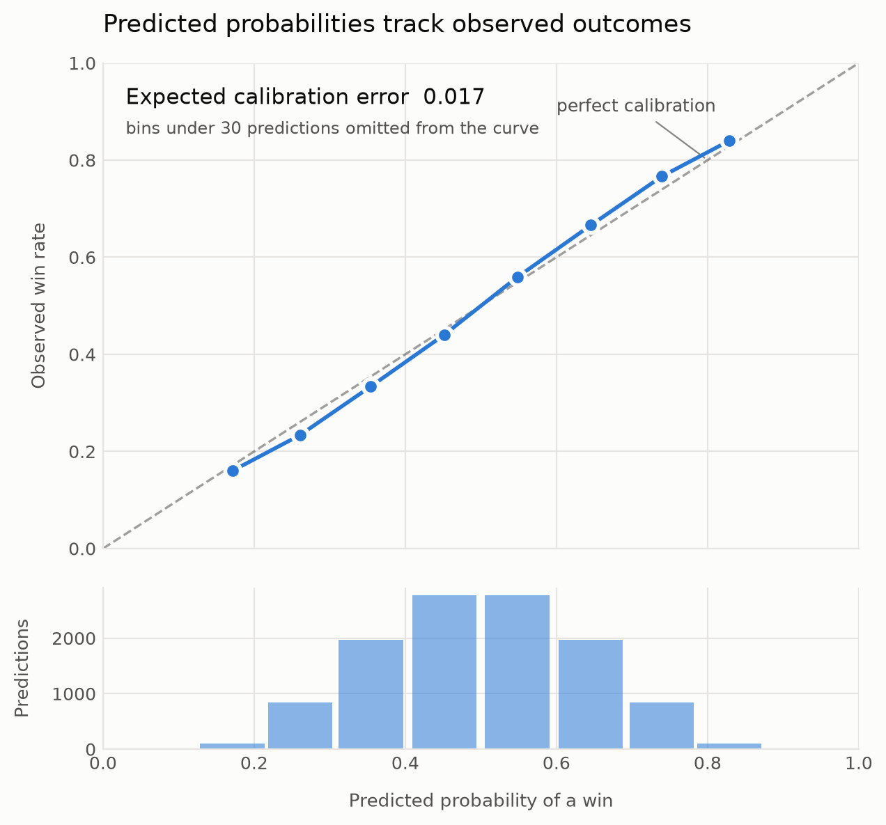
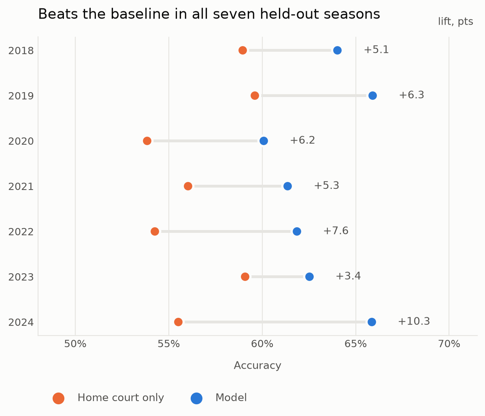

# 🏀 Swish — NBA Game Outcome Predictor

[](https://github.com/nakulpatel0306/swish-nba-match-predictor/actions/workflows/ci.yml)
[](https://www.python.org/)
[](LICENSE)

Forecasts whether an NBA team wins their **next** game, from nine seasons of scraped box scores, with **calibrated probabilities** and a leak-free walk-forward backtest.

Not "which team is better" — a forecast, made before the game, with a stated confidence that turns out to mean what it says.

---

## 📊 Results

**63.2% accuracy on 11,371 held-out predictions** across seven seasons (2018–2024), against a 56.8% home-court baseline. Every number below is regenerated by `python -m src.report`; the full appendix is in [`reports/RESULTS.md`](reports/RESULTS.md).

| Model | Accuracy | AUC | Brier |
|---|---|---|---|
| Coin flip (target is 50/50 balanced) | 50.0% | — | — |
| Raw box score features | 54.2% | — | — |
| Home-court advantage only | 56.8% | — | — |
| XGBoost, 30 selected features | 61.4% | 0.656 | — |
| XGBoost, all 397 features | 62.4% | 0.668 | — |
| Logistic regression on rolling form + opponent | 62.6% | 0.676 | 0.227 |
| **↳ after game-level reconciliation** | **63.2%** | **0.678** | **0.226** |

Three results carry this project.

### 1. The model knows which games it knows

<picture>
  <source media="(prefers-color-scheme: dark)" srcset="reports/figures/tiers-dark.png">
  
</picture>

A single accuracy figure averages games the model is nearly certain about with games that genuinely are coin flips. Split by how far the predicted probability sits from 0.5:

| Tier | Definition | n | Accuracy |
|---|---|---|---|
| Toss-up | \|p − 0.5\| < 0.05 | 2,930 | 54.0% |
| Lean | 0.05 ≤ \|p − 0.5\| < 0.15 | 4,856 | 61.4% |
| **Confident** | \|p − 0.5\| ≥ 0.15 | 3,572 | **73.0%** |

The model is not uniformly 63% accurate. On the roughly one game in three it is most sure about, it is right nearly three times in four — and it says *which* third in advance, before the game is played.

### 2. The probabilities are honest

<picture>
  <source media="(prefers-color-scheme: dark)" srcset="reports/figures/calibration-dark.png">
  
</picture>

A confidence tier only means something if the underlying probability does. **Expected calibration error is 0.017** — of the games called at 70%, close to 70% are won. The curve sits slightly *outside* the diagonal at both ends, which is mild under-confidence: reconciliation pulls probabilities toward 0.5, so the model claims a little less than it delivers. That is the safe direction to be wrong in.

### 3. It holds up season by season

<picture>
  <source media="(prefers-color-scheme: dark)" srcset="reports/figures/seasons-dark.png">
  
</picture>

A 63% average carried by one lucky year is a different, weaker claim. The model beats the home-court baseline in **all seven** held-out seasons, by between 3.4 and 10.3 points — and a test asserts it, so a regression that breaks it fails CI.

The baseline itself is worth reading: home-court advantage collapses to 53.8% in 2020 and 56.0% in 2021, the bubble and empty-arena seasons. The naive baseline degrades when the league changes; the form-based model does not degrade with it.

---

## 🧠 How It Works

### 1. Data ingestion
Async scraper on **Playwright** (headless Chromium) and **BeautifulSoup**, pulling every box score from basketball-reference for 2016–2024.

- Retry with exponential backoff on timeouts
- Local HTML caching, so re-runs skip pages already fetched
- Two-stage crawl — season schedule pages first, then individual box scores

### 2. Feature extraction
Each box score becomes a team-game row combining **basic and advanced stats**, as team totals and per-player maxima (`fg%`, `ts%`, `ortg`, `drtg`, `usg%`, `tov%`, and more). Each game yields two rows, one per team, with the opponent's line joined on as `_opp` columns.

**Output:** 17,534 team-game rows × 154 raw columns.

### 3. Feature engineering
This is where the accuracy comes from.

- **Rolling 10-game form** — every stat re-expressed as a trailing 10-game mean, computed *within* each team-season so form never leaks across a season boundary
- **Opponent-matchup merge** — each row joined against the rolling form of the team it is about to play, so the model sees both sides before the game
- **Home/away flag** for the next game
- **Target** — the team's result in their *next* game, shifted per team in date order

**Output:** 14,818 rows × 397 candidate features.

### 4. Feature selection
**Forward sequential selection** narrows 397 candidates to 30, scored under `TimeSeriesSplit` so selection never peeks at future seasons. `RidgeClassifier` drives it — fast, and it selects well. The result is cached in `artifacts/selected_features.json`: it is deterministic given the data, and it is by far the slowest step.

### 5. Modeling and validation
`LogisticRegression(max_iter=3000, C=0.5)` — L2-regularized for stability on a wide, highly collinear feature space, and emitting **probabilities** rather than hard labels.

Validation is **walk-forward by season**: train on every prior season, test on the next unseen one, roll forward. No shuffling, no future data in training.

### 6. Game-level reconciliation
Every game appears twice — once from each team's point of view — and the model scores the two rows independently. Left alone it contradicts itself: on **11.6% of games it predicted that both teams win, or that both lose.**

For a game between A and B, one row estimates `p_A = P(A wins)`, the other `p_B = P(B wins)`. Two estimates of one event, from opposite sides:

```python
p_A_final = (p_A + (1 - p_B)) / 2
p_B_final = 1 - p_A_final
```

The two now sum to 1 by construction, so contradictions are not merely rare — they are **structurally impossible**, and a test asserts it. It is also worth +0.6 points of accuracy and improves AUC and Brier score.

Rows group on a symmetric key (the two team names sorted, plus the date). A few rows lose their partner in the merge and dropna steps upstream; those are skipped and **counted** (13 of 11,371), never dropped silently.

---

## 📂 Project Structure

```
.
├── notebooks/                     # Interactive, documented workflow
│   ├── getData.ipynb              # Async scrape of box scores
│   ├── parse_data.ipynb           # Parse HTML into structured features
│   └── predict.ipynb              # Engineer, select, train, backtest
├── src/
│   ├── config.py                  # Paths and constants
│   ├── features.py                # Feature engineering
│   ├── get_data.py                # Scraper
│   ├── parse_data.py              # HTML → structured rows
│   ├── predict.py                 # Model, backtest, reconciliation, benchmarks
│   ├── evaluate.py                # Calibration, ECE, per-season breakdown
│   ├── plots.py                   # README figures (light + dark)
│   └── report.py                  # Regenerates every committed artifact
├── tests/                         # Leakage, reconciliation, calibration, quality
├── data/
│   ├── raw/                       # Scraped HTML (gitignored)
│   └── processed/nba_games.csv    # Cleaned dataset (committed)
├── artifacts/                     # Cached feature selection
├── reports/                       # RESULTS.md + figures
├── .github/workflows/ci.yml       # Lint + tests on 3.11 / 3.12 / 3.13
└── main.py                        # End-to-end orchestrator
```

---

## 🚀 Getting Started

```bash
python -m venv .venv && source .venv/bin/activate   # Windows: .venv\Scripts\activate
pip install -r requirements.txt
playwright install chromium        # only needed to re-scrape
```

Run the modeling pipeline against the committed dataset:

```bash
python main.py                     # full report, ~15 min (includes benchmarks)
python main.py --skip-baselines    # ~1 min
python -m src.report               # regenerate RESULTS.md and the figures
python -m src.predict --json out.json
```

Re-scrape from scratch (several hours, due to rate-limit sleeps):

```bash
python main.py --scrape
```

Notebooks and tests:

```bash
jupyter notebook                   # open notebooks/ and run in order
pip install -r requirements-dev.txt && pytest
```

> `data/processed/nba_games.csv` is committed, so you can go straight to `notebooks/predict.ipynb` without a multi-hour scrape.

---

## 🛠️ Tech Stack

**Python** · **pandas** · **scikit-learn** · **XGBoost** · **Playwright** · **BeautifulSoup** · **NumPy** · **Matplotlib** · **Jupyter** · **pytest** · **GitHub Actions**

---

## 🔍 Design Notes

**Why a linear model over a boosted tree?** Because it was benchmarked, not assumed. XGBoost (`n_estimators=400, max_depth=4, learning_rate=0.05`) ran on identical walk-forward splits and **lost on both feature sets** — 61.4% on the 30 selected features, 62.4% on all 397, against 63.2%.

The reason is the shape of the data: ~400 rolling features that are heavily collinear (a 10-game mean of `fg` and of `fga` move together almost perfectly) across only ~15K rows. L2 regularization shrinks correlated coefficients together and degrades gracefully; an unconstrained tree ensemble keeps splitting on near-duplicate features and overfits at that feature-to-sample ratio. Reported as measured — XGBoost was not tuned until it won.

**Why logistic regression rather than ridge?** `RidgeClassifier` emits hard labels only: no way to express confidence, no way to check calibration, and no probability to reconcile the two views of a game with. Logistic regression is the same kind of L2-regularized linear model with a probability attached. Ridge still drives feature *selection*, where speed matters and probabilities do not.

**Why walk-forward instead of k-fold?** Random cross-validation on time-ordered data leaks future information into training and inflates accuracy. Every split respects chronology, and a test asserts that each fold's maximum training date is strictly before its minimum test date.

**Why predict the *next* game?** Predicting the current game from its own box score is trivially easy and useless — the final score is in the features. Forecasting forward from prior form is the actual problem.

**Rejected: schedule features.** Rest days, back-to-back flags and trailing-7-day game density were all built and evaluated. Combined lift was **+0.05 percentage points** — noise. They are deliberately not in the model. A negative result is still a result, and shipping a feature that does nothing is worse than not shipping it.

**On the baselines' row counts.** The headline numbers cover 11,371 held-out predictions. The raw-box-score baseline covers 13,450: it needs no 10-game warm-up, so it keeps the first nine games of each team's season that the rolling pipeline necessarily drops.

---

## 🧪 Tests

19 tests, run on Python 3.11–3.13 in CI. They cover the things most likely to be quietly wrong:

1. **No temporal leakage** — every fold's max training date is strictly before its min test date.
2. **Rolling windows respect season boundaries** — no window spans two seasons for one team.
3. **Reconciliation is symmetric** — paired probabilities sum to 1.0; contradiction rate is exactly 0.
4. **Probabilities are calibrated** — expected calibration error stays under 0.05.
5. **Beats the home-court baseline** — overall, and in every individual season.

The last three are quality gates, not smoke tests: a change that wins accuracy by wrecking calibration, or by trading one season away for another, fails the build.

---

## 🗺️ Roadmap

- [x] Benchmark gradient-boosted trees against the linear baseline
- [x] Output calibrated win probabilities instead of hard labels
- [x] Reconcile the two per-game predictions into one
- [x] Report calibration, confidence tiers and per-season robustness
- [ ] **Benchmark against the betting market** — convert historical closing moneylines to vig-free implied probabilities, compare calibration against the market's, and compute flat-bet ROI restricted to the confident tier. The likely finding is that the model does *not* beat the closing line; that is the interesting result, and it is what turns this from a prediction exercise into a forecasting-versus-market evaluation.
- [ ] Track injury and lineup availability
- [ ] Serve predictions through a small API and dashboard
