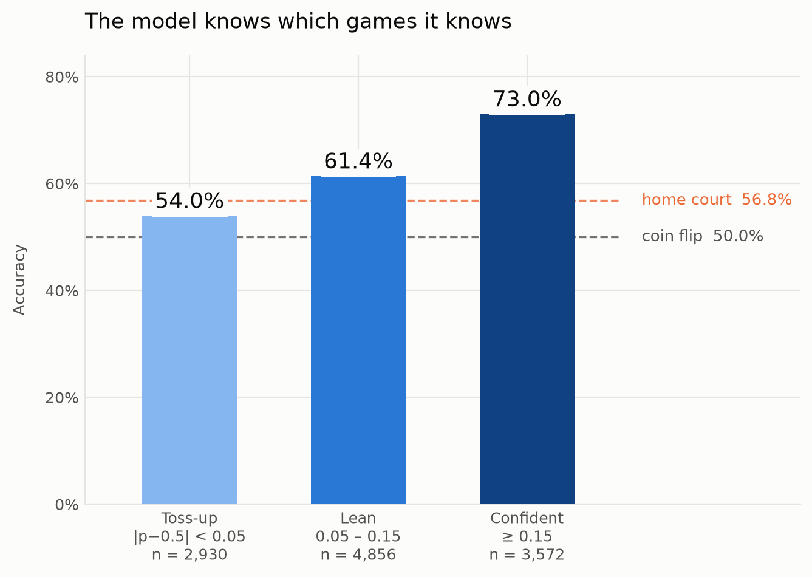

# Swish - NBA Game Outcome Predictor

[](https://github.com/nakulpatel0306/swish-nba-match-predictor/actions/workflows/ci.yml)
[](https://www.python.org/)
[](LICENSE)

Predicts whether an NBA team wins its **next** game, using nine seasons of scraped box scores. It outputs calibrated win probabilities and is tested with a leak-free, season-by-season backtest.

## At a Glance

- **Stack:** Python, pandas, scikit-learn, XGBoost, Playwright, BeautifulSoup, Matplotlib, pytest, GitHub Actions
- **Data:** Every box score from basketball-reference, 2016 to 2024
- **Result:** 63.2% accuracy on 11,371 held-out games, vs a 56.8% home-court baseline
- **State:** Complete, with the roadmap below

## Results

| Model | Accuracy | AUC | Brier |
|---|---|---|---|
| Coin flip | 50.0% | - | - |
| Raw box score features | 54.2% | - | - |
| Home-court advantage only | 56.8% | - | - |
| XGBoost, 30 selected features | 61.4% | 0.656 | - |
| XGBoost, all 397 features | 62.4% | 0.668 | - |
| Logistic regression on rolling form + opponent | 62.6% | 0.676 | 0.227 |
| **After game-level reconciliation** | **63.2%** | **0.678** | **0.226** |

<picture>
  <source media="(prefers-color-scheme: dark)" srcset="reports/figures/tiers-dark.png">
  
</picture>

- **It knows which games it knows.** On the third of games it is most confident about, it is right 73.0% of the time.
- **The probabilities are honest.** Expected calibration error is 0.017, so games called at 70% are won about 70% of the time.
- **It holds up every season.** It beats the home-court baseline in all seven held-out seasons, by 3.4 to 10.3 points, including the 2020 bubble year.

All numbers are regenerated by `python -m src.report`. The full appendix is in [reports/RESULTS.md](reports/RESULTS.md), and the calibration and per-season charts are in [reports/figures](reports/figures).

## How It Works

1. **Scrape:** async Playwright crawler with retries, backoff and local HTML caching
2. **Parse:** each box score becomes two team-game rows (one per team) with basic and advanced stats, 17,534 rows total
3. **Engineer:** rolling 10-game form within each season, joined with the opponent's form and a home or away flag, giving 397 features
4. **Select:** forward selection down to 30 features, scored with `TimeSeriesSplit` so it never sees future seasons
5. **Train and validate:** L2 logistic regression, trained on all prior seasons and tested on the next one, rolling forward
6. **Reconcile:** each game is scored from both teams' sides, so the two probabilities are averaged into one pair that always sums to 1. This removes the 11.6% of games where the model said both teams win (or both lose) and adds 0.6 points of accuracy.

## Design Notes

- **Linear over boosted trees:** XGBoost was benchmarked on the same splits and lost. With about 400 highly correlated features over about 15K rows, L2 regularization generalizes better.
- **Logistic over ridge:** ridge only outputs labels. Logistic regression gives probabilities to calibrate and reconcile. Ridge still drives feature selection, where speed matters.
- **Walk-forward over k-fold:** random folds leak future games into training. A test checks every fold's training dates end before its test dates.
- **Schedule features rejected:** rest days and back-to-backs added only 0.05 points, so they were left out.

## Project Structure

```
.
├── src/
│   ├── get_data.py      # Scraper
│   ├── parse_data.py    # HTML to structured rows
│   ├── features.py      # Feature engineering
│   ├── predict.py       # Model, backtest, reconciliation, benchmarks
│   ├── evaluate.py      # Calibration and per-season breakdown
│   ├── plots.py         # README figures (light and dark)
│   └── report.py        # Regenerates every committed result
├── notebooks/           # Same pipeline, step by step
├── tests/               # Leakage, reconciliation, calibration and quality gates
├── data/processed/      # Cleaned dataset (committed)
├── artifacts/           # Cached feature selection
├── reports/             # RESULTS.md and figures
└── main.py              # End-to-end runner
```

## Running Locally

1. Set up the environment:
   ```bash
   python -m venv .venv && source .venv/bin/activate   # Windows: .venv\Scripts\activate
   pip install -r requirements.txt
   ```
2. Run the pipeline on the committed dataset:
   ```bash
   python main.py --skip-baselines    # about 1 minute
   python main.py                     # full report with benchmarks, about 15 minutes
   python -m src.report               # regenerate RESULTS.md and figures
   ```
3. Optional extras:
   ```bash
   playwright install chromium && python main.py --scrape   # re-scrape, takes hours
   pip install -r requirements-dev.txt && pytest            # run the tests
   ```

## Tests

19 tests run on Python 3.11 to 3.13 in CI. They check for temporal leakage, rolling windows that cross seasons, reconciled probabilities that sum to 1, calibration error under 0.05, and beating the home-court baseline overall and in every season. A change that improves accuracy by breaking calibration or one season fails the build.

## Roadmap

- [x] Benchmark boosted trees against the linear model
- [x] Calibrated probabilities and game-level reconciliation
- [x] Confidence tiers and per-season reporting
- [ ] Benchmark against betting market closing lines
- [ ] Add injury and lineup data
- [ ] Serve predictions through a small API and dashboard
